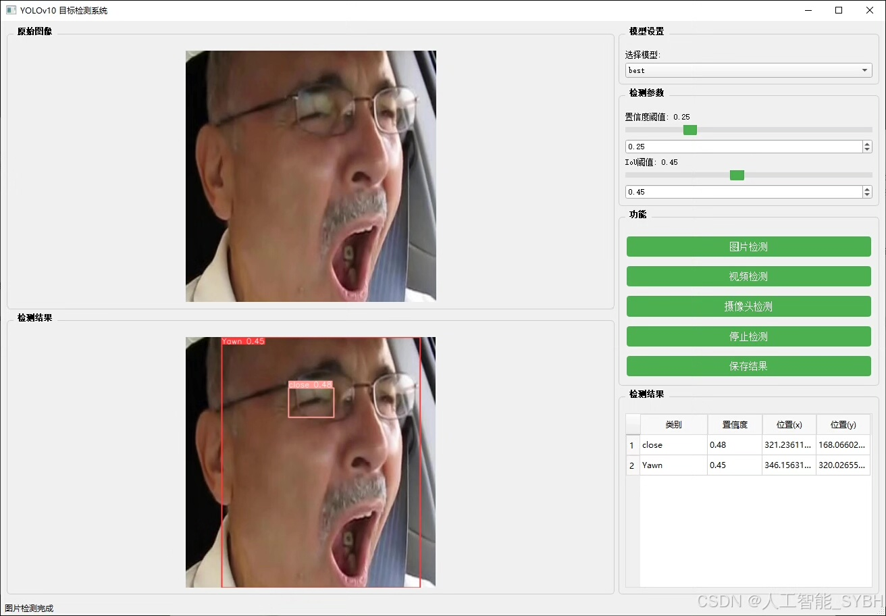
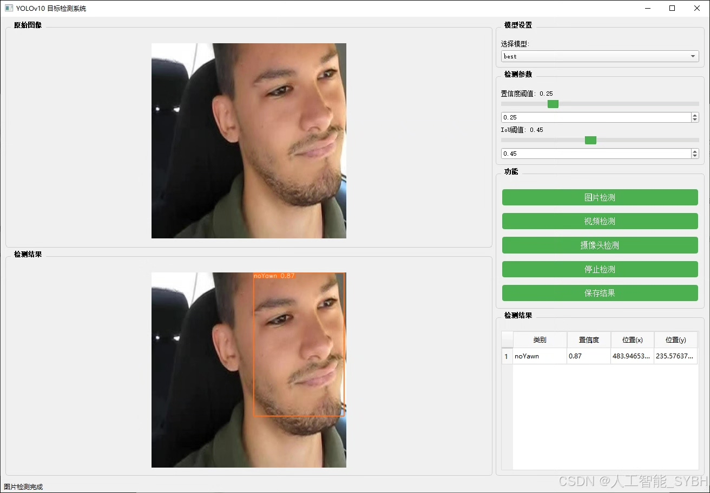
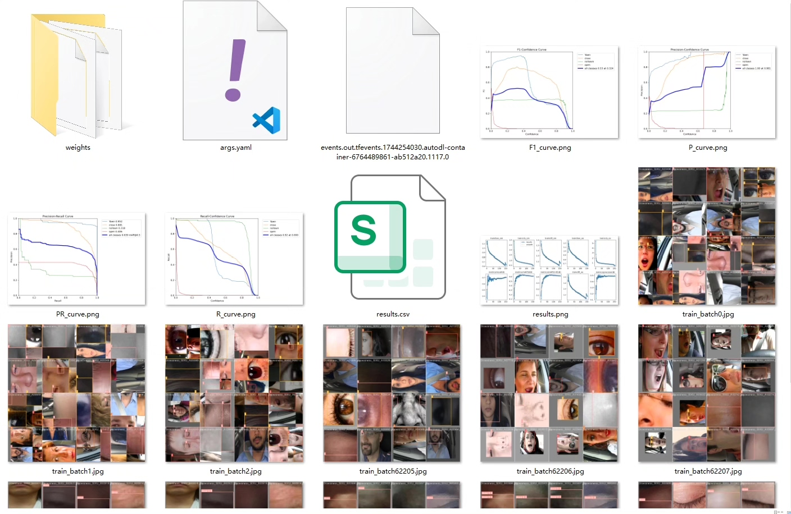
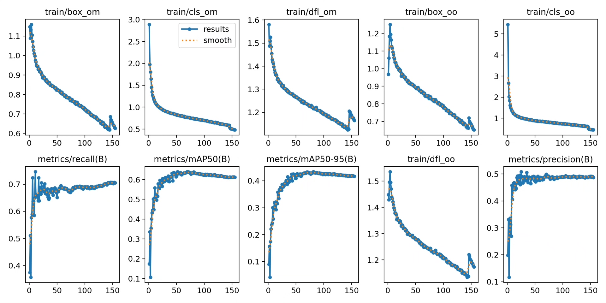
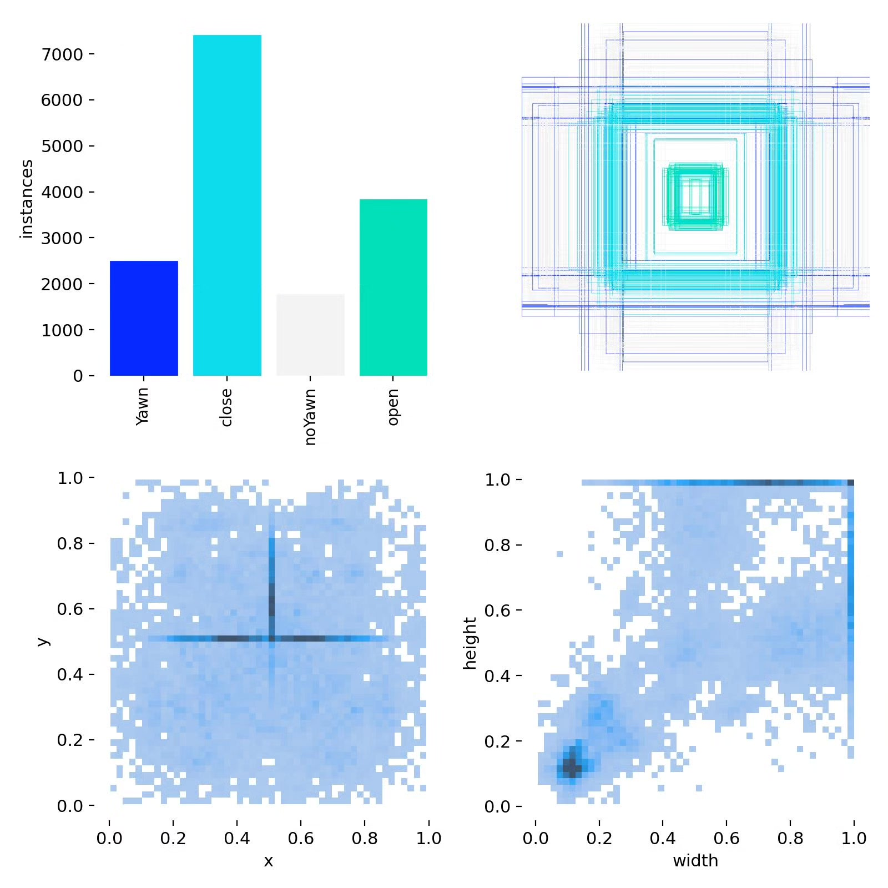
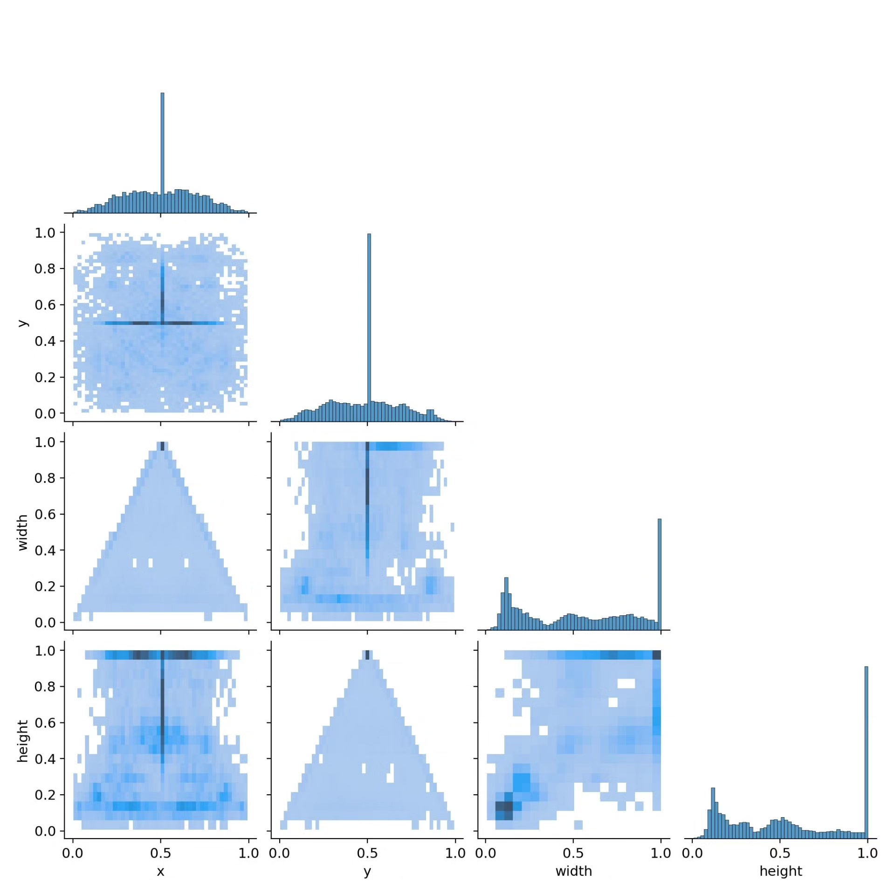
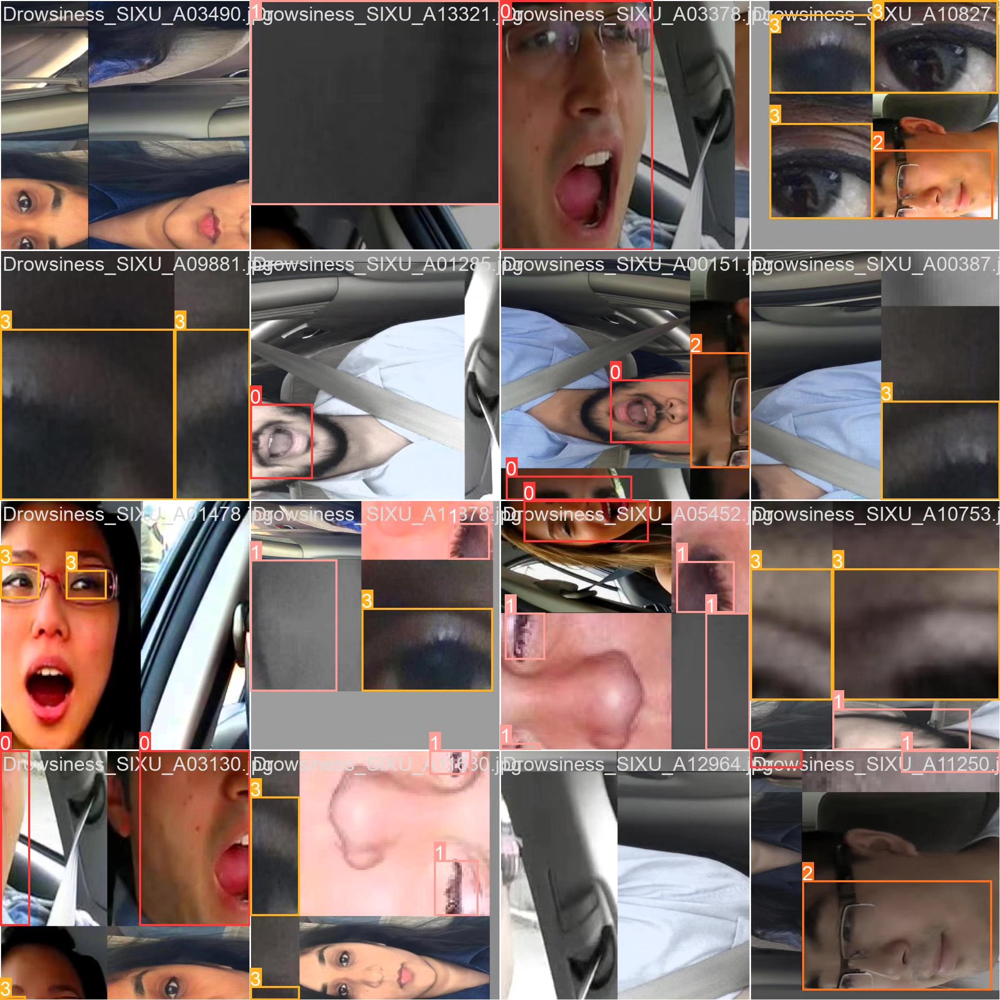

# Based on YOLOv10 deep learning for fatigue driving detection system

## Body

This project aims to develop a fatigue detection system based on YOLOv10, which can detect the driver's fatigue state in real-time. The system analyzes the driver's facial expression, especially the state of their eyes and mouth, to determine whether they are in a fatigued state. The model is divided into four categories: yawning (Yawn), closing eyes (close), not yawning (noYawn), and open eyes (open). Through deep learning technology, the system can quickly and accurately identify these states, thereby providing timely fatigue warnings for drivers and improving driving safety.

Training set: 13,719 images
Validation set: 1,380 images
Test set: 1,147 images

The company's product has obtained the YOLO official commercial license certification.

Package after-sales service

After payment, we will provide WeChat IDs for instant questions and answers.

Environment configuration: A tutorial on environment configuration will be provided, with WeChat answering questions.

Remote installation service: If you need remote configuration, an additional fee of 69 is required, with all fees refunded if the configuration fails (only refund installation fees for older computers).

Retraining dataset: After setting up the environment, you can train on your own computer. If you need us to retrain, just pay 69 plus computing power fees (2.5 yuan/hour).

Full after-sales service

## Images

## Payment

Here is a pay link on Stripe ( https://buy.stripe.com/3cs8yP7sY87d0vu9AB ). Please contact me lonlonago@foxmail.com after funding $89, and I will send you a complete data files , thank you!

